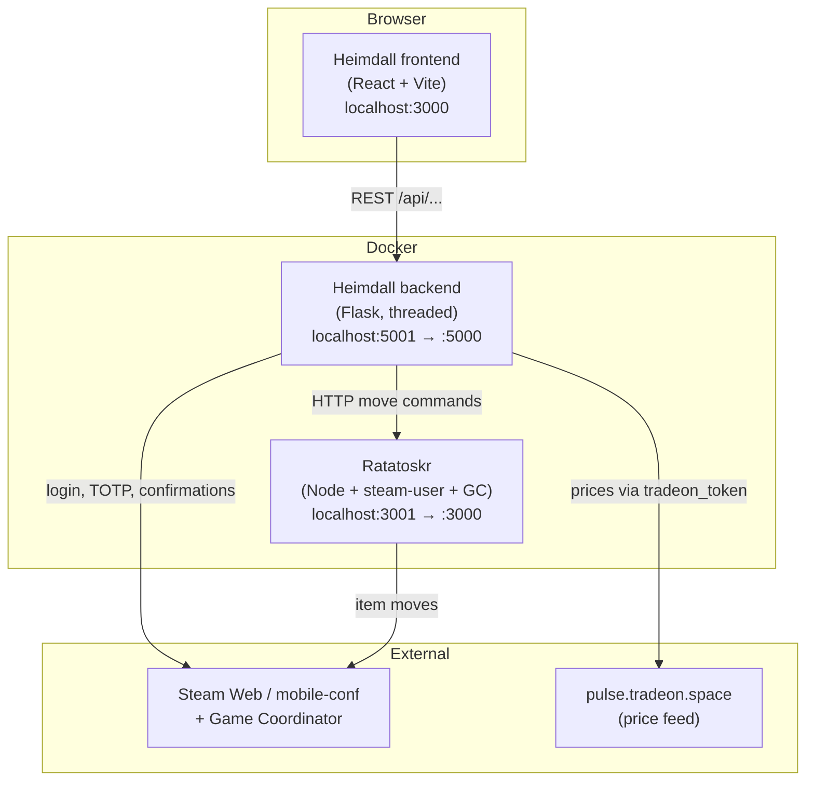
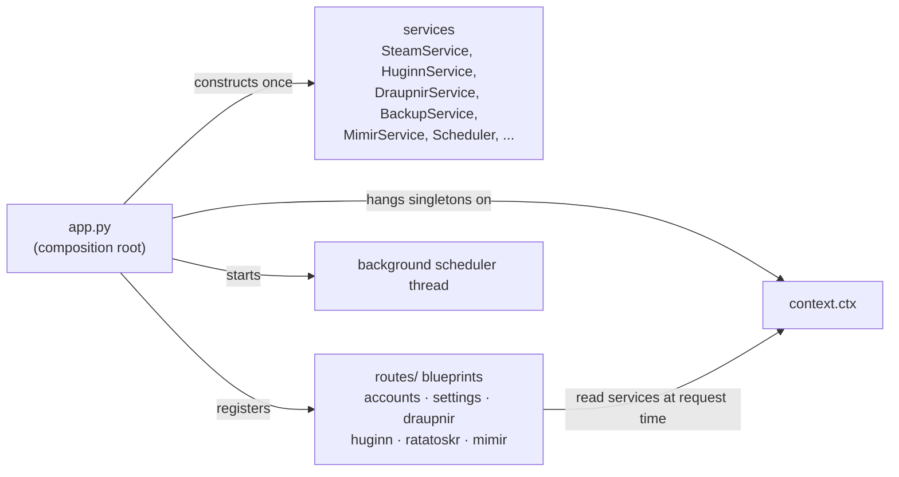
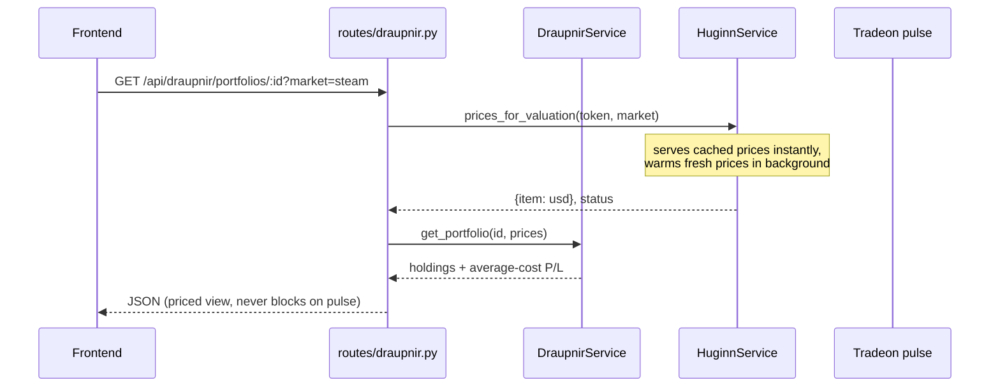
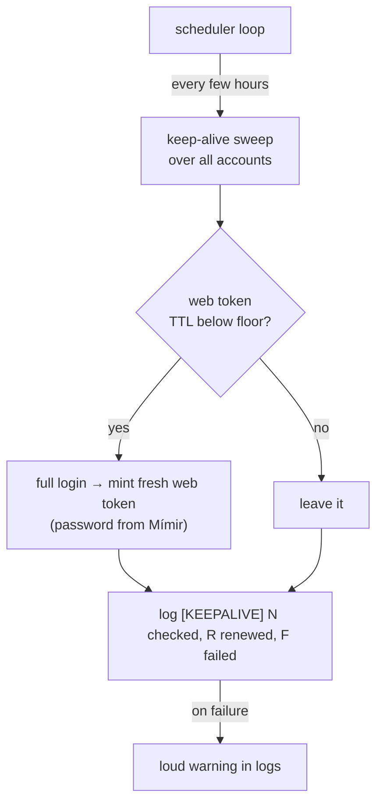

# Architecture — steam-odin

How the pieces fit together, for a human reading the code for the first time.

- **Just want to run it?** → [README.md](README.md)
- **You are an AI coding agent?** → [CLAUDE.md](CLAUDE.md)
- **This document** explains the *mental model*: topology, how a request flows,
  the Steam session/token lifecycle, the data model, and how it is operated.

This is a personal, open-source Steam-trading toolset. Everything is named after
Norse figures, but the naming is decoration — the code hierarchy is the truth.

---

## 1. The realms (topology)

Three long-running processes, all in Docker, orchestrated by
`docker-compose.yml`. The browser talks only to the frontend and the backend;
the backend is the only thing that talks to Steam and to Ratatoskr.



Key point: **the frontend never calls Ratatoskr or Steam directly.** All of it
is proxied through the Flask backend, which owns credentials, tokens, and rate
limiting.

## 2. Inside Heimdall — the tools

Heimdall started as a Steam authenticator and grew a set of tools. Each tool is
a backend service + a set of frontend pages; none is a separate deployable.

| Tool | Norse role | What it does | Backend | Frontend |
|------|-----------|--------------|---------|----------|
| Authenticator | Heimdall, the Watchman | TOTP codes, login sessions, mobile confirmations | `steam_service.py`, `scheduler.py` | `Confirmations.jsx`, `AddAccount.jsx` |
| **Draupnir** | The Hoard | Portfolio tracker: buy/sell, average-cost profit/loss, live valuation, point-in-time backups | `draupnir_service.py`, `draupnir_backup_service.py` | `pages/draupnir/` |
| **Huginn** | The Scout | Cross-market price scouting + case arbitrage, off the Tradeon pulse feed | `huginn_service.py` | `pages/huginn/` |
| **Mímir** | The Well of Wisdom | Encrypted credential vault (login / password / email) | `mimir_service.py` | `pages/mimir/` |
| **Ratatoskr** | The Courier | Moves items between Storage Units and inventory | `ratatoskr_service.py` → Node | `pages/ratatoskr/` |

Two of the tools feed each other: **Draupnir values holdings using Huginn's
price feed**, so it reuses the same `tradeon_token` — no separate configuration.
**Mímir supplies passwords** that let the authenticator do a full Steam login
(maFiles do not carry the password).

## 3. Backend shape

The Flask backend is a small composition-root pattern.



- `app.py` builds every service **once** at boot, stores them on `context.ctx`,
  registers the route blueprints, then starts the scheduler and serves with
  `threaded=True`.
- Blueprints in `routes/` are thin: they validate input and call into a service
  read from `ctx`. Business logic lives in the `*_service.py` modules.
- Because `ctx` is filled only by `app.py`, it is empty in any standalone
  interpreter — see [CLAUDE.md](CLAUDE.md) for why that matters when scripting.

### Example request flow — "show me a portfolio, priced"



The valuation path is deliberately **non-blocking**: pages render immediately on
cached prices (or cost basis) and prices fill in on a later poll, so a slow or
rate-limited price feed never freezes the UI.

## 4. The Steam session & token lifecycle

This is the subtle part of the whole system, and the source of past outages.

- A Steam **mobile confirmation** request needs an authenticated web session
  cookie, which needs a valid **web access token**.
- That web token **expires roughly every 24 hours**.
- The only reliable way to mint a fresh one is a **full login**
  (`begin_auth_session`) — which needs the account password, which comes from
  the **Mímir vault**. (`GenerateAccessTokenForApp` returns empty even for fresh
  refresh tokens, so it cannot be used to refresh the web token.)

To keep this from lapsing, `scheduler.py` runs a proactive **keep-alive sweep**:



Operational tell: watch the logs for `[KEEPALIVE] … failed`. If confirmations
break fleet-wide, the web token has lapsed and the renewal path (usually the
password lookup) is the first suspect.

> Also note: the confirmation endpoint's `a` parameter must be the **SteamID64**,
> not the 32-bit account id. The wrong form returns a message that *looks* like a
> rate limit but is not.

## 5. Data model

State is plain files on disk (no database yet), which keeps the whole thing
portable and easy to back up.

| File | Holds | In git? |
|------|-------|---------|
| `backend/portfolios.json` | All Draupnir portfolios + transactions | **Yes**, on purpose (no secrets) |
| `backend/backups/portfolios/*.json.gz` | Snapshot history of the above | No (gitignored) |
| `backend/maFiles/*.maFile` | Steam Guard secrets (TOTP + identity secrets) | No — **secret** |
| `backend/.heimdall_key`, `.heimdall_salt` | Encryption key/salt for maFiles + vault | No — **secret** |
| `backend/credentials.vault` | Mímir: encrypted login/password/email | No — **secret** |
| `backend/settings.json` | App settings incl. `tradeon_token` | No — **secret** |
| `backend/csfloat_keys.json` | CSFloat API key rotation pool | No — **secret** |

Portfolio shape:

```
portfolios.json
└── portfolios: { <id>: {
        id, name, created_at, updated_at,
        transactions: [ {
            id, item_name, type (buy|sell), qty, price,
            platform, date, note, fee_percent, created_at
        } ]
    } }
```

Valuation is computed on read (average-cost basis vs. live price); it is never
stored, so prices never go stale in the file.

### Backups (Draupnir point-in-time restore)

`portfolios.json` is hand-entered and cannot be regenerated, so every write and
once-a-day the backup service snapshots it:

- **Content-addressed**: filename carries a sha1 of the uncompressed content, so
  identical states dedupe for free.
- **Compressed**: snapshots are gzip (`*.json.gz`, roughly 10× smaller); legacy
  plain `.json` snapshots are still read.
- **GFS retention**: keep everything for 7 days, then thin to daily up to 90
  days, then weekly up to 2 years.
- **Safe restore**: restoring first snapshots the current state (as
  `pre-restore`) so the restore is itself reversible.

## 6. Frontend shape

React 19 + Vite + react-router-dom 7, single-page app.

- The **Dashboard** loads eagerly; every tool page is **code-split** with
  `React.lazy` + `Suspense`, so the initial bundle stays small and each tool
  loads on navigation.
- `pages/` holds route-level screens; `components/` holds the reusable pieces
  (market links, arbitrage panels, transfer queue, backups panel, and so on);
  `utils/` holds per-market helpers (Steam / Buff / CSFloat / LisSkins price
  links, Tradeon short links, transfer view math).
- The frontend only ever calls the backend REST API; it has no direct knowledge
  of Steam or Ratatoskr.

## 7. Operational model

- **Everything is Docker.** `make odin` builds and starts the fleet; see
  [README.md](README.md) for the full command list and ports.
- **Rate limiting is a first-class concern.** Steam throttles hard (HTTP 429),
  so item moves are serial with a delay, the scheduler sleeps between accounts,
  and the price feed is cached and warmed in the background. Do not remove these
  guards to "go faster".
- **Continuous integration** (`.github/workflows/ci.yml`) runs the backend
  pytest suite + ruff + `pip-audit`, and the frontend lint + build, on every
  push and pull request. The backend test suite is the real safety net; the
  frontend relies on lint + build.
- **Secrets never enter git or leave the machine.** They are all gitignored and
  excluded from the Docker build context. See [SECURITY.md](SECURITY.md).

---

*See also: [README.md](README.md) (setup + commands), [CLAUDE.md](CLAUDE.md)
(agent guide + gotchas), [docs/steam-trading/](docs/steam-trading/) (the trading
domain knowledge this toolset is built around).*
