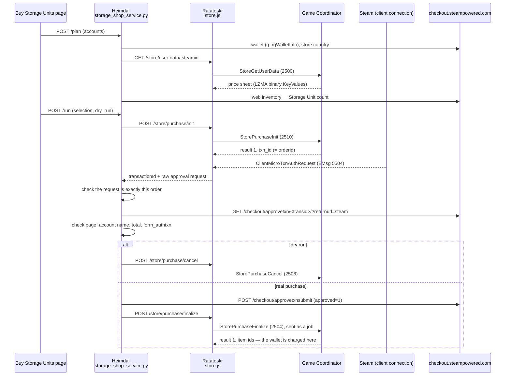

# Buy Storage Units — how buying a Storage Unit works

How Heimdall buys Counter-Strike 2 **Storage Units** on many accounts, written
from the live runs that made it work (October 2026). Read this before touching
`Yggdrasil/ratatoskr/store.js` or
`Yggdrasil/heimdall/backend/storage_shop_service.py` — almost every line there
exists because something failed live without it.

- **Users:** the page is http://localhost:3000/buy-storage-units (called the
  "Storage shop" in the code: `storage_shop_service.py`, `/api/ratatoskr/storage-shop`,
  `StorageShop.jsx`); see [the user guide](../guide/ratatoskr.md#buy-storage-units).
- **Agents:** the rules at the end of this page are binding.

---

## 1. Why it exists

A Storage Unit holds 1,000 items. Gjallarhorn's rotation (sell, then buy the
case Valve just limited, on every account) needs empty space everywhere at
once. Storage Units are sold **only in the game's own store**, which lives
behind the Counter-Strike 2 **Game Coordinator** — there is no web store page
and no Market listing to buy from. So the purchase must take the same path the
game client takes, over Ratatoskr's logged-in Counter-Strike 2 session.

Idea sources: the open-source Casemove app (Storage Unit handling over the Game
Coordinator) and request captures from a commercial tool; the protocol details
below were confirmed against Valve's own client code (`econ_store.h`,
`BYldSendMessageAndGetReply`) and live traffic.

## 2. The pieces

| Layer | File | Job |
|-------|------|-----|
| Page | `frontend/src/pages/ratatoskr/StorageShop.jsx` | Account table, order panel, review dialog, live progress, results |
| Routes | `backend/routes/ratatoskr.py` | `GET /api/ratatoskr/storage-shop`, `POST …/plan`, `…/run`, `…/deliver-again` |
| Service | `backend/storage_shop_service.py` | Plan, every guard, approval on the web, history |
| Client | `backend/ratatoskr_service.py` | `store_user_data`, `store_purchase_init`, `store_purchase_finalize` (75 s timeout), `store_purchase_cancel` |
| Courier | `ratatoskr/store.js` + endpoints in `server.js` | Game Coordinator messages, catching Steam's approval request |
| Store Catalogue | `store_catalogue_service.py`, `pages/ratatoskr/StoreCatalogue.jsx`, `GET /api/ratatoskr/store-catalogue`, `POST …/refresh` | Read-only list of every store item from the same sheet (section 3.1) |

## 3. The protocol, step by step

### 3.1 Price sheet — `StoreGetUserData` (2500 → 2501)

The answer carries `price_sheet`: Valve's LZMA container — the bytes `LZMA`,
uint32 uncompressed size, uint32 compressed size, 5 LZMA property bytes, then
the data — wrapping **binary KeyValues** (type byte, null-terminated key,
value; types 0 section, 1 string, 2 int32, 3 float, 4 pointer, 6 wide string,
7 color, 10 uint64; 8 or 11 end a section). Python's `lzma` reads it as
`FORMAT_ALONE` once the 13-byte "alone" header is rebuilt
(`decode_price_sheet`).

The Storage Unit is the entry **`casket`** under `store.entries`, with
`prices` in minor units per currency (for example USD 199, EUR 175). A
currency missing from the sheet (Turkish lira, for one) cannot buy.

**The rest of the sheet** (read live 2026-10-03, about 5,900 bytes, 251 entries,
37 currencies) is what the **Store Catalogue** page shows
(`store_catalogue_service.py`):

- `store.entries` is keyed by the item's **internal name** from `items_game`
  (`casket`, `Name Tag`, `community_35_key`, `coupon - noisia_01`), each with
  `item_link`, `category_tags` and `prices`. A **coupon** is how the store
  sells something that turns into another item when bought (a sticker, a music
  kit, a capsule). Ratatoskr's `POST /items/store-names` turns internal names
  into definition indexes and English names; two are named by hand
  (`sticker_display_case` is the Sticker Slab, `Weapon Case Key` — definition
  1203 — is the CS:GO Case Key).
- `store.store_banner_layout` is the **store front**, keyed by definition
  index (`custom_format` single / double / coupon / new). Case keys, the game
  license and the Armory Pass are sold but not on it. Cases appear on it with
  `market_link: 1`: they only link to the Market and are not in `entries`.
- `store.currencies` holds one number per currency (USD 88888, EUR 76474 …),
  not a price; the catalogue ignores it.

Every read of the sheet goes to `StorageShopService.on_price_sheet`, which the
catalogue sets at boot, so a wallet check refreshes it for free. The
catalogue's **Read prices again** is this service's `price sheet` job
(`start_price_sheet`): one login, read, log out — never beside a plan or a
purchase, because it shares the job lock.

### 3.2 Opening — `StorePurchaseInit` (2510 → 2511)

Fields: `country`, `language` 0, `currency`, and one line item
`{item_def_id: 1201, quantity, cost_in_local_currency: unit price, purchase_type: 0}`.

- **`currency` is the game store's own 0-based enum** (`ECurrency` from
  `econ_store.h`: USD 0, GBP 1, EUR 2, RUB 3, BRL 4, JPY 8, NOK 9 … HKD 27 …
  BYN 42 — `GAME_STORE_CURRENCIES`). Sending Steam's wallet currency code
  (USD 1) is answered with result **8, "invalid parameter"**.
- **`country`**: the store country first, then the country Steam reports for
  the login. With the login's country on an account whose store country
  differs, the approval page later failed. Only result 8 moves on to the next
  country; a refused open opens nothing.
- The price must equal the sheet exactly.
- The answer: `result` 1 and a 10-digit `txn_id`. Its `url` is **empty** —
  the game would open the Steam overlay here. Nothing is paid yet.

### 3.3 Steam's approval request — `ClientMicroTxnAuthRequest` (EMsg 5504)

Right after an opened transaction, Steam (not the Game Coordinator) sends the
client this message. `steam-user` has no handler for it, so `store.js`
registers one on `SteamUser.prototype._handlerManager` and re-emits it as
`microTxnAuthRequest`; `initPurchase` waits up to 10 s for it and returns its
raw bytes.

Its body is the byte `0x01` followed by binary KeyValues, section
`MessageObject`:

| Key | Meaning |
|-----|---------|
| `orderid` | The Game Coordinator's `txn_id` |
| `transid` | **Steam's** 18-digit transaction id — the one the approval page takes |
| `appid` | 730 |
| `lineitems` | `{0: {description, gameitemid 1201, amount, quantity}}` |
| `currency` | Steam's **wallet** currency code (here USD is 1) |
| `total`, `BillingTotal` | The total in minor units |

`check_auth_request` refuses anything but exactly this order: `orderid` equal
to the opened transaction, app 730, a single line of the ordered item's
definition (1201 for a Storage Unit) in the planned quantity, `total` and
`BillingTotal` equal to the planned total, and the wallet's currency.

**Key names come in either case.** For a sticker capsule (2026-10-03, dry run)
Steam sent `OrderID` instead of `orderid`, plus `BillingCurrency`, `Refundable`,
`SteamRealm`, `Tax`, `VAT`, `RequiresCachedPmtMethod`, `sandbox`. The check reads
every key case-insensitively; the same key twice with different values is a
mismatch. A coupon's line item carries the coupon's own definition (20188 for
the 10 Year Birthday Sticker Capsule) and its English name as `description`.

### 3.4 Approval — the web page

`GET https://checkout.steampowered.com/checkout/approvetxn/<transid>/?returnurl=steam`
with the account's web session (cookies from Heimdall's own login). Using the
Game Coordinator's id instead gives *"An unexpected error occurred while
authorizing your transaction"*.

The page must:

- contain the form **`form_authtxn`** — method POST, an action containing
  "approve" on a checkout or store host (`/checkout/approvetxnsubmit`), the
  fields `transaction_id` (this transaction), `returnurl`, `sessionid` and
  `approved`;
- read **"Steam account: <login>"** for this account;
- show the planned total (`amount_shown`; some currencies are printed without
  decimals — `WHOLE_UNIT_CURRENCIES`).

The form ships with `approved=0`; the page's Authorize button runs
`AuthorizeTransaction(true)`, which sets it to 1 before submitting — so the
shop sends `approved=1`. Steam answers **302** with `Location: steam`. The
last page read is kept in `cache/storage_shop_approval_page.html` (local,
gitignored) so a layout change can be inspected.

**Approval alone does not charge the wallet.**

### 3.5 Delivery — `StorePurchaseFinalize` (2504 → 2505)

`{txn_id}`; the answer carries `result` 1 and the new item ids. **This is the
moment the wallet is debited.**

**Finalize must be sent as a Game Coordinator job** (`user.sendToGC(730, type,
{}, payload, callback)` sets a source job id, as Valve's client does with
`BYldSendMessageAndGetReply`). Sent as a plain message, the Game Coordinator
never answered — not even in 60 s — and nothing was charged. `store.js` now
sends every store request as a job and also accepts a plain message of the
reply type.

### 3.6 Cancelling — `StorePurchaseCancel` (2506 → 2507)

Drops a transaction that was never approved. The dry run ends here.

## 4. The guards (why it is safe to press Pay)

| Guard | Where |
|-------|-------|
| Plan expires after 30 minutes; Pay needs the plan's `created_at` | `start_purchase` |
| At most 20 per account per purchase; a Storage Unit never above **$2.50** (list price $1.99), any other item never above its US dollar list price × 1.25, in any currency | `MAX_QUANTITY_PER_ACCOUNT`, `MAX_USD_PER_UNIT`, `PRICE_TOLERANCE` |
| The plan fixes the item (entry, definition index from Ratatoskr's item list); Pay is refused when the page shows another item; the game license and the Armory Pass are never sold | `start_plan`, `start_purchase`, `NOT_FOR_SALE_ENTRIES` |
| Wallet currency unchanged and balance covers the total — re-read just before buying | `_buy_account` |
| Fresh price sheet must equal the planned unit price | `_buy_account` |
| Steam's approval request must be exactly this order | `check_auth_request` |
| Approval page must name the account, show the total and carry the form for this transaction | `approval_form`, `amount_shown` |
| One account at a time, 5 s apart; web calls 2 s apart; steamcommunity.com 4 s apart (shared `community_pacer`) | constants at the top |
| Any failure before approving cancels the transaction | `finally` in `_buy_account` |
| From approval on, nothing is cancelled and a failure says **"MAY BE PAID"** | `payment_attempted` |
| Finalize tried 5 times, 3 s apart; a lost session is logged in again | `_finalize` |
| A Ratatoskr store request that timed out closes that session's store until a fresh login (a late answer could be mistaken for the next request's) | `session.storeClosed` in `store.js` |
| The shop logs a session out only if it opened it, and never while items are moving | `_session`, `_close`, `_finalize` |
| **Deliver again** re-sends Finalize for an unclear purchase; Finalize only delivers an approved transaction, so it cannot pay twice | `start_deliver_again` |

The Ratatoskr login for a purchase pauses that account's ASF farming (one
"playing" session per account); the account is logged out afterwards unless a
session was already open.

## 5. Storage Unit counts

The table counts Storage Units from the **public web inventory**:
`steamcommunity.com/inventory/<steamid>/730/2?l=english&count=2000`, paged
with `start_assetid` (`last_assetid` / `more_items`), counting assets whose
`market_hash_name` is "Storage Unit". Empty units are listed too, and no login
is needed. An unreadable inventory, or one with more than 10 pages, gives
"unknown" — never a guess. A count of zero shows as 0.

Counts and wallets are remembered per account (`known` in
`cache/storage_shop.json`) so the page shows the last values with their age
without reading Steam.

## 6. What failed live, and the fix

| Symptom | Cause | Fix |
|---------|-------|-----|
| Init answered result 8 | Steam's wallet currency code sent | Game store's 0-based enum |
| "An unexpected error occurred while authorizing your transaction" | Approval page opened with the Game Coordinator's id | Use `transid` from EMsg 5504 |
| Approval looked accepted but nothing moved | Form sent with `approved=0` | Send `approved=1`, as the Authorize button does |
| Finalize: no answer in 60 s, wallet untouched | Sent without a job id | Every store request is a job |
| "Steam Guard code rejected" | Same 30 s code reused in one window | Not a shop bug: retry in the next code window |

After the job fix, **Deliver again** delivered the purchase that had been left
unclear: one Storage Unit, one charge of $1.99 in the purchase history.

Other items (2026-10-03, dry runs of a $0.99 sticker capsule — nothing paid):

| Symptom | Cause | Fix |
|---------|-------|-----|
| "approval request does not match (order None …)" | Steam spelled the key `OrderID` | Keys read case-insensitively |
| "approval page does not show the planned total 99" | "$0.99" compared as the digits "099" | Leading zeros ignored |

The third dry run passed every check. A real purchase of an item other than a
Storage Unit has not been made yet: delivery is judged by the item ids the
store returns (no inventory count), so check the first one in the account's
inventory.

## 6a. Any store item

`StorageShopService` sells any price sheet entry; `casket` stays the default
everywhere, so Buy Storage Units is unchanged. The item travels as `item` (the
entry name) on `GET /api/ratatoskr/storage-shop?item=`, `POST …/plan` and
`POST …/run`; the plan stores `entry`, `item_name`, `definition_index`,
`usd_list_price` and `max_usd_per_unit`, and every history entry carries
`entry`, `item_name` and `definition_index` (older entries without them are
Storage Units). Ratatoskr's `/store/purchase/init` takes `itemDefinitionIndex`
(default 1201). Storage Units are counted only when buying Storage Units. The
page is the same component (`StorageShop.jsx`) at `/store-catalogue/buy/:item`.

## 7. Rules for agents (binding)

1. **Money is spent only through the guarded Heimdall routes**
   (`/api/ratatoskr/storage-shop/…`). Never call Ratatoskr's raw
   `/store/purchase/*` endpoints to buy, and never write a script that does.
2. Test with **dry run**. A real purchase only on Ivan's explicit word, for the
   account and quantity he named.
3. Do not loosen a guard to make a test pass. If Steam's page or messages
   change, the guard should fail and keep the page in the cache for a look.
4. Do not parallelise accounts or shorten the gaps (Steam rate limits).
5. After editing `store.js`, `docker restart steam-odin-ratatoskr-1` — it does
   not hot-reload, and the restart drops every live session.
6. The pure helpers (`decode_price_sheet`, `check_auth_request`,
   `approval_form`, `amount_shown`, `plan_account`) are covered by
   `backend/tests/test_storage_shop_service.py`, including bytes captured from a
   real approval request. Keep them pure and extend the tests with any new
   capture.
